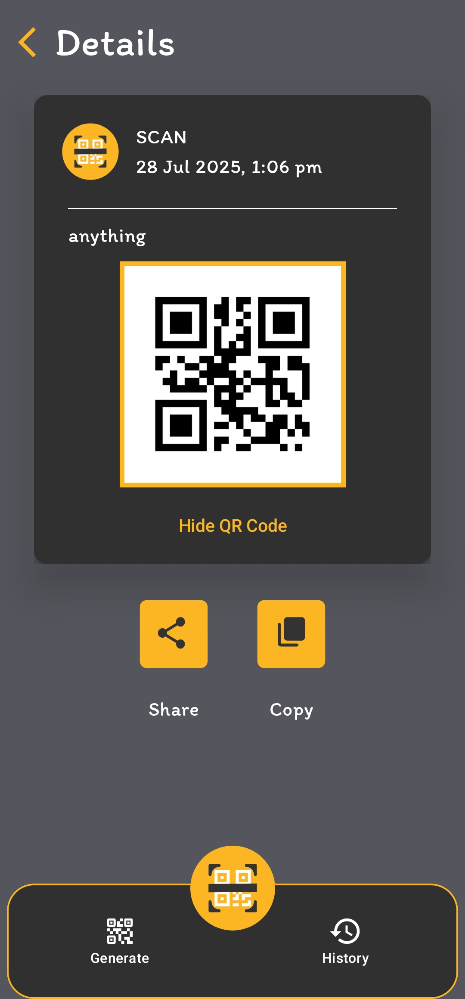

# Code App

## A Modern QR Code Scanner and Generator for Android

Code App is a sleek and intuitive Android application built with the latest technologies to provide a seamless experience for all your QR code needs. Whether you're scanning codes on the go or creating your own, Code App has you covered.

-----

## Features

  * **Fast and Accurate Scanning:** Quickly scan QR codes using your device's camera.
  * **Generate a Variety of QR Codes:** Create QR codes for:
      * Text
      * Websites
      * Wi-Fi networks
      * Events
      * Contact information
      * And more\!
  * **History:** Keep track of all your scanned and generated QR codes.
  * **Favorites:** Mark your most important QR codes for easy access.
  * **Customizable Experience:** Tailor the app to your liking with settings for vibration and beep sounds upon successful scans.

-----

## Screenshots

<p align="center">
  
  
  
  
  
  
  
  
  
</p>


-----

## Tech Stack

Code App is built with a modern Android tech stack, including:

  * **Kotlin:** The primary programming language.
  * **Jetpack Compose:** For building the user interface.
  * **CameraX:** For camera functionalities.
  * **ML Kit:** For barcode (QR Code) scanning.
  * **Hilt:** For dependency injection.
  * **Room:** For local database storage of your history and favorites.

-----

## Getting Started

To get started with Code App, you'll need to have Android Studio installed.

1.  **Clone the repository:**
    ```bash
    git clone https://github.com/asadbytes/code-app.git
    ```
2.  **Open in Android Studio:**
    Open the cloned repository in Android Studio.
3.  **Build and Run:**
    Build and run the app on an Android emulator or a physical device.

-----

### Build Instructions

To build the app from source using the command line:

```bash
./gradlew assembleRelease

The signed release APK will be located in:

Copy
Edit
app/build/outputs/apk/release/

-----

## Contributing

Contributions are welcome\! If you have any ideas, suggestions, or bug reports, please open an issue or create a pull request.
<<<<<<< HEAD

## License

Code App is licensed under the [MIT License](LICENSE).
=======
>>>>>>> 3d869e0bc5fa6eae8e844d03849ed539b87f17d4
