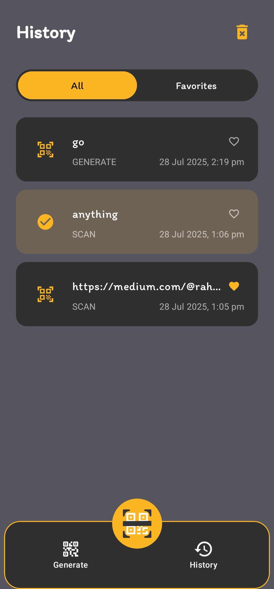

# Code App


A modern and intuitive QR Code Scanner and Generator for Android, built with the latest technologies to provide a seamless experience for all your QR code needs.

## ✨ Features

* **Fast & Accurate Scanning**: Quickly scan QR codes using your device's camera, powered by ML Kit.
* **Generate Various QR Codes**: Create QR codes for Text, Websites, Wi-Fi networks, Events, Contacts, and more.
* **History**: Keeps a log of all your scanned and generated QR codes for easy access.
* **Favorites**: Bookmark your most important QR codes to find them in a flash.
* **Customizable Experience**: Tailor the app's feedback with settings for vibration and sounds on successful scans.
* **Modern UI**: A clean, user-friendly interface built entirely with Jetpack Compose.

## 📸 Screenshots

| Start Screen                                     | Scanner                                          | Scan Result                                    |
| ------------------------------------------------ | ------------------------------------------------ | ---------------------------------------------- |
|  |  |  |

| Input Screen                                     | Details Screen                                     | History                                          |
| ------------------------------------------------ | -------------------------------------------------- | ------------------------------------------------ |
|  |  |  |

| History with Gestures                            | Settings                                           | Alert Dialog                                     |
| ------------------------------------------------ | -------------------------------------------------- | ------------------------------------------------ |
|  |  |  |

## 🛠️ Technologies Used

This project is built with a modern Android development tech stack:

* **Kotlin**: The primary programming language.
* **Jetpack Compose**: For building the entire user interface declaratively.
* **Android Jetpack**:
    * **CameraX**: For a robust and easy-to-use camera implementation.
    * **Room**: For local database storage of history and favorites.
    * **ViewModel**: To manage UI-related data in a lifecycle-conscious way.
* **Google ML Kit**: For high-performance on-device Barcode (QR Code) scanning.
* **Hilt**: For dependency injection.

## 🚀 Getting Started

To get a local copy up and running, follow these simple steps.

### Prerequisites

* Android Studio.
* An Android device or emulator.

### Installation

1.  **Clone the repository:**
    ```sh
    git clone [https://github.com/asadbytes/code-app.git](https://github.com/asadbytes/code-app.git)
    ```
2.  **Open in Android Studio:**
    Open the cloned project folder in Android Studio.
3.  **Sync Gradle:**
    Let Android Studio download all the required dependencies.
4.  **Run the app:**
    Click the 'Run' button to build and launch the app on your device or emulator.

## 🤝 Contributing

Contributions are what make the open-source community such an amazing place to learn, inspire, and create. Any contributions you make are **greatly appreciated**.

If you have a suggestion that would make this better, please fork the repo and create a pull request. You can also simply open an issue with the tag "enhancement".

1.  Fork the Project
2.  Create your Feature Branch (`git checkout -b feature/AmazingFeature`)
3.  Commit your Changes (`git commit -m 'Add some AmazingFeature'`)
4.  Push to the Branch (`git push origin feature/AmazingFeature`)
5.  Open a Pull Request

## 📄 License

Distributed under the MIT License. See `LICENSE` for more information.

---

<p align="center">
  Made with ❤️ by asadbytes
</p>
